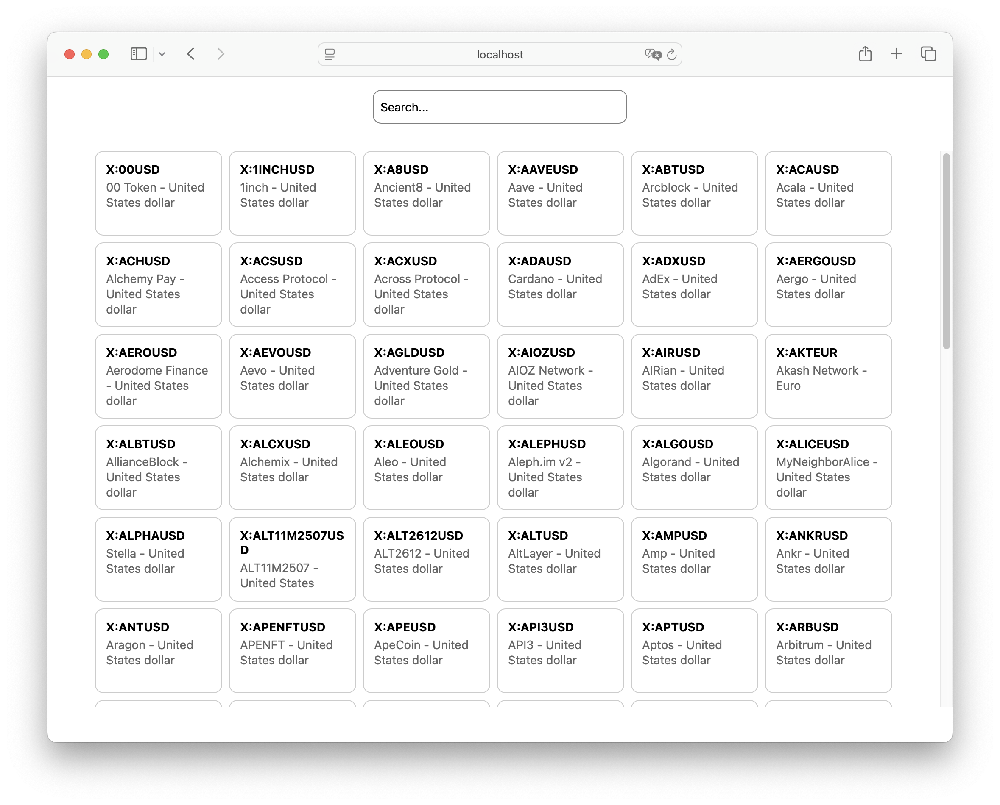

# 🚀 poligon API integration  example

*it's an educational project and migth be a template for your start*

<p>
  
  
</p>

## Before Start

* get a API KEY [poligon API](https://polygon.io)
* create "keys.ts" file at ./src
* file has to contain:

```
export const API_KEY = 'your api key';
```


## Development
```
npm i
npm run pod
npm run web | ios | android
```

## Deployment web
```
npm run build-web
```

## Description

* React-Native and React-Native-Web
* Splash Screen by using [react-native-bootsplash](https://github.com/zoontek/react-native-bootsplash/tree/master)
* [poligon API](https://polygon.io) for data
* @tanstack/react-query for requests, caching and errors
